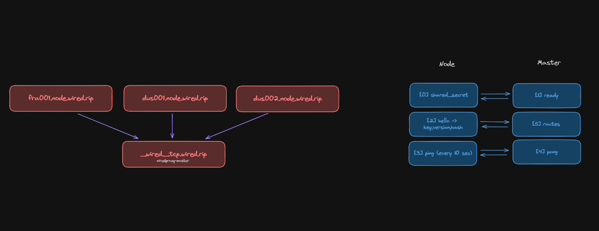

# Wired

*The name of this project is inspired by the anime "Serial Experiments Lain" which is a cyberpunk anime that deals with the concept of the Wired, a virtual world that is connected to the real world, representing the internet.*

## Outline

- [Introduction](#introduction)
- [Features](#features)
- [Infrastructure](#infrastructure)
- [Installation and Usage](#installation-and-usage)

## Introduction
Wired consists of two systems, the "master" and the "node" sub-project. The master system is responsible for managing the nodes and the node system is responsible for proxying Minecraft connections (so called "routes") given by the master system.

Each node connects to the master system on _wired._tcp.wired.rip which points to the current master host and port. Once connected, the master and node will encrypt their communication using a shared secret key. The node sends data such as key identifier (e.g. "dus001.node"), version and binary hash to the master. If the node seems to be outdated, the master will send the latest binary to the node. The node will then restart itself to apply the update.

Soon, there will be a frontend for the master system which can be used to manage routes and view traffic statistics and online players.

## Features
- **Master System**
  - Manage nodes
  - Update nodes
  - Manage routes
  - View traffic statistics
  - View online players

- **Node System**
    - Proxy Minecraft connections
    - Update itself

## Infrastructure

| Record Type | Name | Value |
| --- | --- | --- |
| A | dus001 | x.x.x.x |
| A | dus002 | x.x.x.x |
| A | shield | dus001 |
| A | shield | dus002 |
| CNAME | master | dus001 |
| CNAME | *.p | shield |



## Installation and Usage
The master and node will soon be able to install as a systemd service. For now, you can run the master and node manually by cloning the repository and cd'ing into the respective sub-project.

```bash
git clone https://github.com/Northernside/wiredproxy
cd master # or cd node
go run main.go # or go build && ./wired<master/node>
```